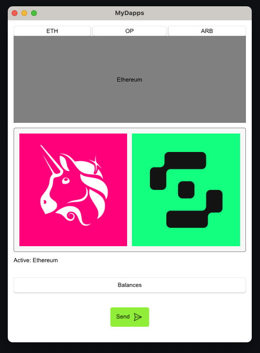
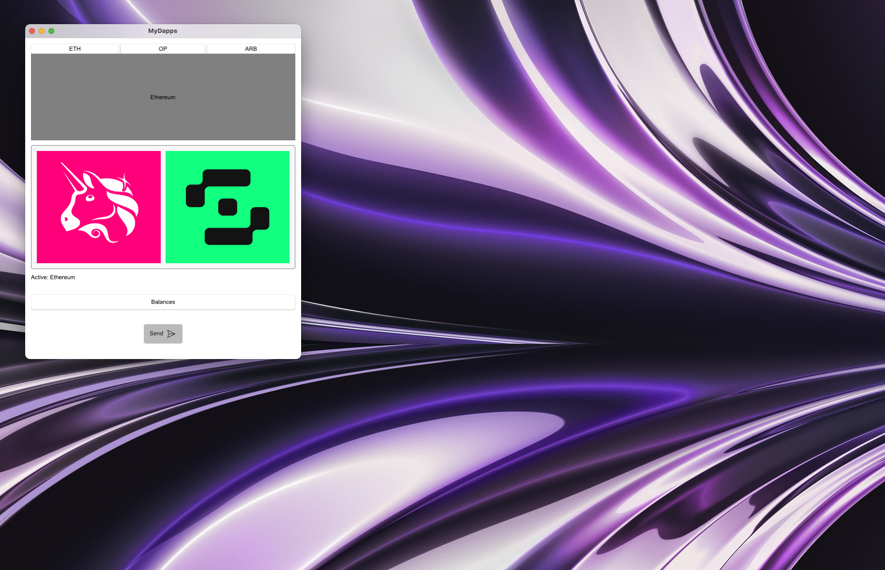

# MyDapps - Learning Slint & Rust

An Ethereum-based desktop application that works in embedded devices...?
<!-- markdownlint-disable MD033 -->
<div align="center">
   
   
</div>


## Usage

1. Install Rust by following the [Rust Getting Started Guide](https://www.rust-lang.org/learn/get-started).
   Once this is done, you should have the ```rustc``` compiler and the ```cargo``` build system installed in your path.
2. Run the application

    ```rust
    cargo run
    ```

## About Slint Rust Template

This template helps you get started developing a Rust application with [Slint](https://github.com/slint-ui/slint/blob/master/tools/lsp/README.md) as toolkit
for the user interface. It demonstrates the integration between the `.slint` UI markup and
Rust code, how to trigger react to callbacks, get and set properties and use basic widgets.

## Make a Slint Rust Template

1. Install Rust by following the [Rust Getting Started Guide](https://www.rust-lang.org/learn/get-started).
   Once this is done, you should have the ```rustc``` compiler and the ```cargo``` build system installed in your path.
2. Install [`cargo-generate`](https://github.com/cargo-generate/cargo-generate)

    ```rust
    cargo install cargo-generate
    ```

3. Set up a sample project with this template

    ```rust
    cargo generate --git https://github.com/slint-ui/slint-rust-template --name my-project
    cd my-project
    ```

4. Build with cargo

    ```rust
    cargo build
    ```

5. Run the application binary

     ```rust
     cargo run
     ```

We recommend using an IDE for development, along with our [LSP-based IDE integration for `.slint` files](https://github.com/slint-ui/slint/blob/master/tools/lsp/README.md). You can also load this project directly in [Visual Studio Code](https://code.visualstudio.com) and install our [Slint extension](https://marketplace.visualstudio.com/items?itemName=Slint.slint).

## Next Steps

We hope that this template helps you get started and you enjoy exploring making user interfaces with Slint. To learn more
about the Slint APIs and the `.slint` markup language check out our [online documentation](https://slint.dev/docs).

Don't forget to edit this README to replace it by yours
